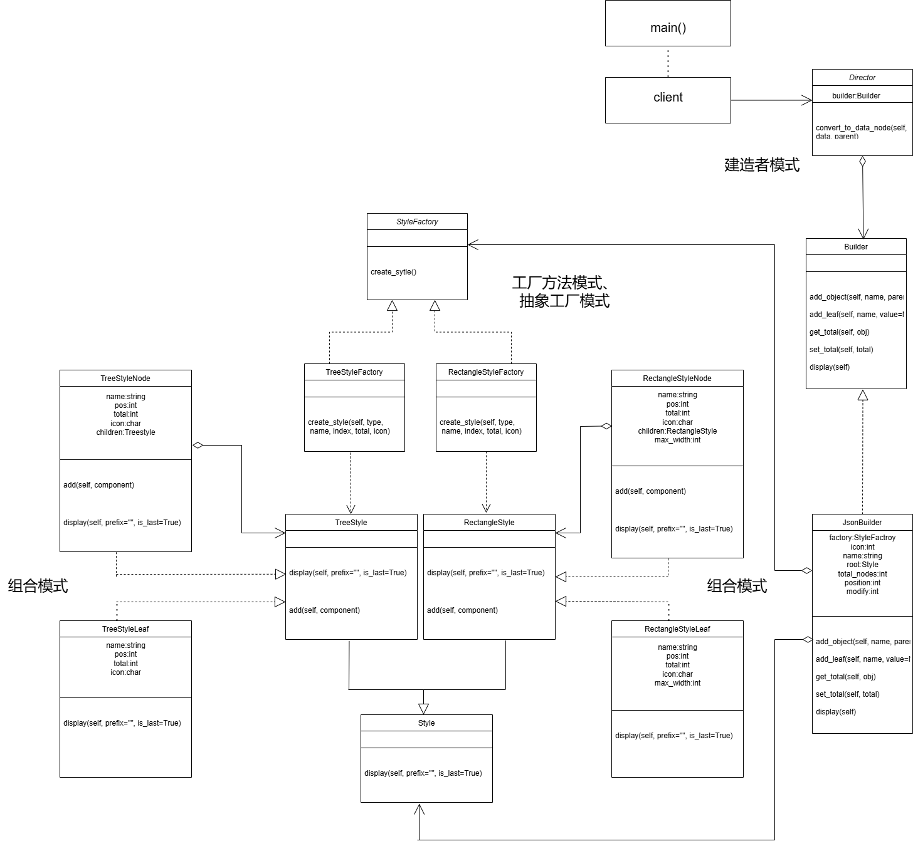
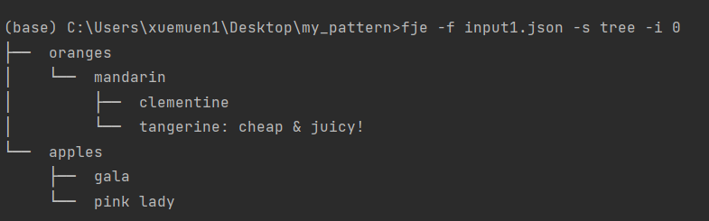
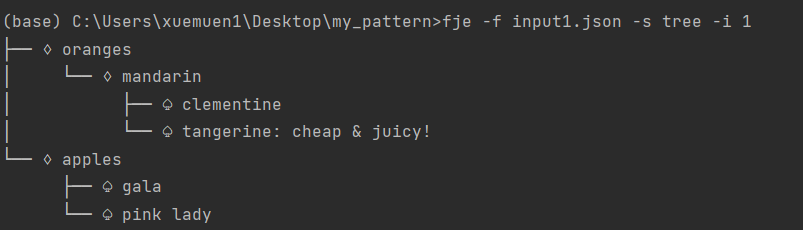
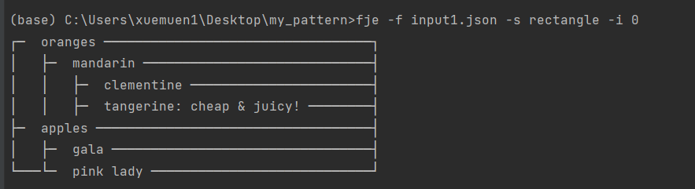
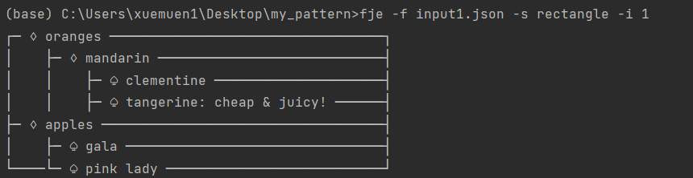
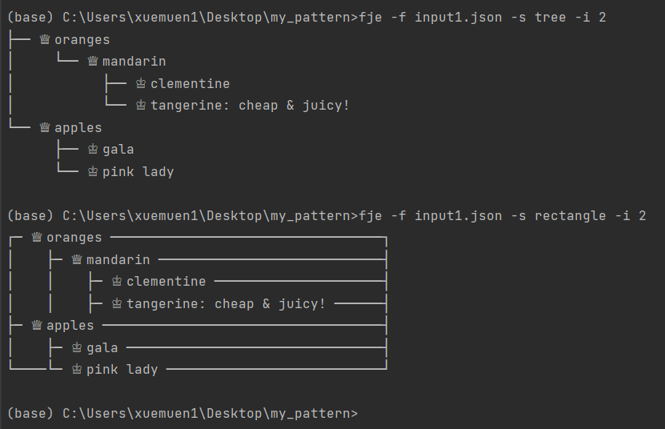
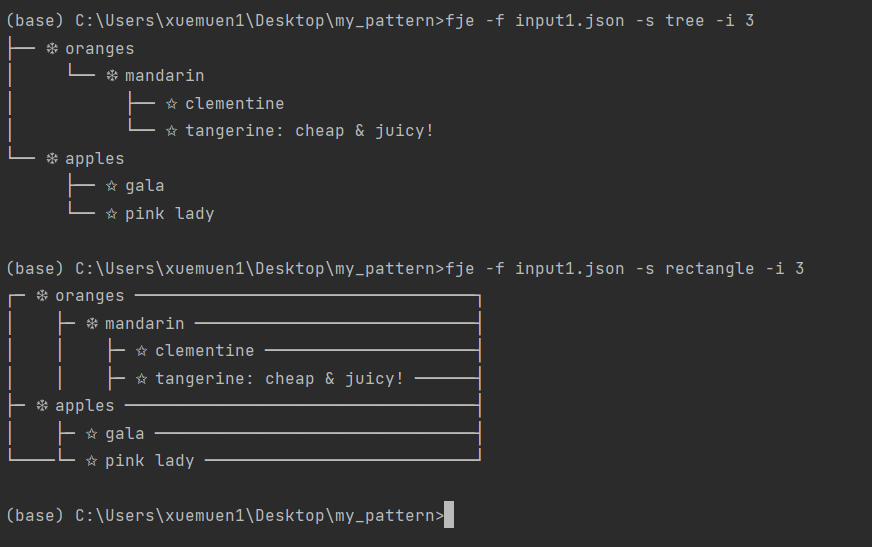
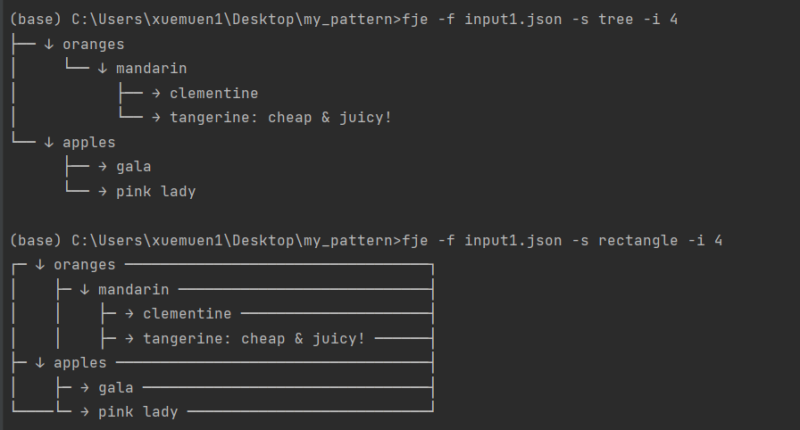

# 设计文档

## 类图

建造者模式中，Buider是Director的一一种属性即has-a的关系，所以我们用尾部为空心菱形的实线箭头来连接它们，JSONBuilder是Builder的一个具体实现，继承Builder。
组合模式中 TreeStyleNode 和 TreeStyleLeaf 都继承 TreeStyle ，RectangleStyleNode 和 RectangleStyleLeaf 都继承 RectangleStyle ,所以 是虚线三角头。 同时 TreeStyleNode中 包含 TreeStyle 列表 ,RectangleStyleNode中 包含 RectangleStyle 列表。
工厂模式中 StyleFactory 是基类抽象类。而TreeStyleFactory 和RectangleStyleFactory都是他的具体实现。而这两个工厂对应的产品就是style的两种风格，之间是依赖关系，使用虚线箭头。

#### 设计模式

**工厂方法**（Factory）
定义了一个创建对象的接口，但由子类决定实例化哪一个类。用于处理实现不同输出风格。
创建一个通用的风格工厂类 StyleFactory。
衍生出具体的风格渲染工厂类 TreeStyleFactory 和 RectangleStyleFactory。

作用：
工厂方法模式的优点在于它实现了松耦合和可扩展性。通过将对象的实例化延迟到子类中去完成，这种模式使得客户端代码与具体产品的创建过程分离，降低了系统各部分之间的依赖程度。同时，引入新的具体工厂类和产品类变得方便，而无需修改现有代码，从而提高了系统的可扩展性。这种设计模式还符合单一职责原则，每个具体工厂类只负责创建一种具体产品，使得系统结构更清晰、易维护。

我们通过工厂方法模式来实现一个通用的风格工厂类 StyleFactory，并衍生出具体的风格渲染工厂类 TreeStyleFactory 和 RectangleStyleFactory。这样，在高层代码中可以通过 StyleFactory 接口创建对象，而无需了解具体实现。通过这种方式，高层代码不需要了解具体的风格实现，只需依赖 StyleFactory 接口即可创建不同的风格对象。这种设计提高了系统的灵活性和可扩展性，符合工厂方法模式的优点。

**抽象工厂**（Abstract Factory）
抽象工厂模式是一种创建型设计模式，它提供一个接口，用于创建一系列相关或依赖的对象，而无需指定它们的具体类。该模式通过多个抽象工厂接口，使得客户端可以在不修改代码的情况下，更方便地切换产品家族。

抽象接口：在 StyleFactory中定义创建相关对象的抽象方法。
具体工厂类如 TreeStyleFactory 和 RectangleStyleFactory 实现抽象接口，实现了工厂族。
每个具体工厂对应不同Style 产品。  TreeshowFactory 对应 TreeStyle ， RectangleStyleFactory 对应 RectangleStyle

作用：
抽象工厂模式的作用是提供一个接口，用于创建一系列相关或依赖的对象，而无需指定它们的具体类。通过定义抽象工厂接口，在具体工厂类如 TreeStyleFactory 和 RectangleStyleFactory 中实现这个接口，可以实现不同风格产品的创建。每个具体工厂对应不同的风格产品，例如 TreeStyleFactory 对应 TreeStyle，RectangleStyleFactory 对应 RectangleStyle。这样可以实现产品家族的创建，同时使得客户端可以在不修改代码的情况下更方便地切换产品家族，从而提高了系统的灵活性和可扩展性。

**组合模式**(composite)
组合模式是一种结构型设计模式，它使你能够将对象组合成树状结构来表示“部分-整体”的层次结构。该模式让客户端可以统一地处理单个对象和对象组合，从而简化了代码的实现。

组件类：定义抽象基类 TreeStyle，RectangleStyle 包括通用的操作方法。
叶子节点和中间节点：TreeStyleLeaf ,RectangleStyleLeaf 表示叶子节点，TreeStyleNode ,RectangleStyleNode 表示组合节点，分别继承自 TreeStyle，RectangleStyle。
用户通过统一的接口（TreeStyle 和 RectangleStyle）处理节点，利用嵌套结构（在 TreeStyleNode ,RectangleStyleNode 中包含 TreeStyle，RectangleStyle元素的列表），可以一致地操作组合结构中的所有元素。

作用：
组合模式允许将对象组织成树形结构，以表示部分和整体的层次关系。它使得客户端可以统一地处理单个对象和组合对象，而无需关注它们的具体实现。这提高了系统的灵活性和可维护性，使得添加新的组件类型变得更加容易。

**建造者**（Builder）模式
建造者模式将一个复杂对象的构建过程与其表示分离，使得同样的构建过程可以创建不同的表示。它通过逐步构建对象并允许灵活修改构建步骤，提高了代码的可读性和可维护性。
Builder：定义抽象类 Builder，包含构建过程的抽象方法。
具体建造者类：具体建造者类 JsonBuilder，负责具体的构建逻辑。构建一棵JSON节点树
Director：Director 类控制建造过程，根据需要调用建造者的方法。construct 函数负责指挥建造过程，并最后输出结果。

作用：
建造者模式使得构建对象的过程更加灵活和可控。它允许使用相同的构建过程生成不同的对象表示，从而提高了系统的扩展性和维护性。通过将复杂对象的创建过程封装在建造者中，客户端代码变得更加简洁和清晰。通过建造者模式，我们可以更好地管理复杂对象的构建过程，使得系统更易于扩展和维护。建造者模式还可以隐藏产品内部结构，使得客户端不需要关心具体的构建细节，从而降低了系统的耦合度

## 图标族
关于图标族是在配置文件config.py中实现的，通过在config中增加图表对则可以增加图标形式。这里都是用unicode标识，可以通过网站 https://unicode.yunser.com/  查找unicode图标的编码。
我也实现了选做部分的功能。通过config.py，添加各种图标，可以添加新的图标族。

## 其他模式
除了以上四种设计模式，我还额外关注并满足了以下**SOLID**设计原则

**单一职责原则（Single Responsibility Principle）**  ：要求一个类应该只有一个引起它变化的原因。我在每个类或函数中都只实现一种功能。对于叶子和style的四种组合模式，我都分开实现了。具体实现了leaf+tree,leaf+rectangle, node+tree, node+rectangle四种输出方式。 这样可以让代码容易维护和Debug。

**开闭原则（Open/Closed Principle）**  ：要求软件实体（类、模块、函数等）应该对扩展开放，对修改关闭。实现了在不改变现有代码就能够进行扩展功能。比如本次作业中包括  fje.py , composite.py ,AbstractFactory.py ,config.py  。
如果要增加风格，则只需要在AbstactFactory.py中增加对应的抽象工厂并且在composite.py文件中添加style产品的具体实现即可。
如果要进行图标族的扩展，则只需要更改config文件，不需要更改其他任何文件，增加图标对即可。
做完这些更改后在fje.py  相关函数中增加  Type 选项就可以正确运行。

**里氏替换原则（Liskov Substitution Principle）** ： 要求子类型必须能够替换掉它们的基类型。在我的实现中所有的子类继承父类的实现，所有子类都可以替代父类实现。我的具体方法是所有的父类都是以Python中的abc来实现(from abc import ABC, abstractmethod)。 如StyleFactory,  Style ,Builder类都是用abc来实现的。

**接口隔离原则（Interface Segregation Principle）**  ：要求客户端不应该被迫依赖它不使用的方法。我为客户端提供了统一接口main()，客户端只需要输入特定的参数即可得到想要的结果。 

**依赖倒置原则（Dependency Inversion Principle）**  ：要求高层模块不应该依赖于低层模块，两者都应该依赖于抽象。抽象不应该依赖于细节，细节应该依赖于抽象。在我的实现中所有的高层模块都不依赖于底层模块，在作业中所有的继承关系都依赖于一个抽象的父类(ABC除外)。  而抽象也都不依赖于具体实现。

## 运行结果
基础的四张图：

## 选做部分

